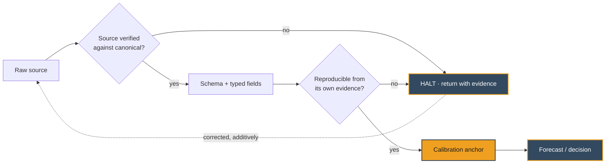

 

**Bremen, Germany** · Working language: English   Five years measuring what advertising actually returned — now building the systems that predict it.

 

  

---

### The problem I work on

Most model failures are not loud. They pass every automated check and are quietly wrong — a metric carrying two incompatible definitions, a validator silently running only a self-test, a baseline computed inside the event it was supposed to measure. These are the errors that survive the pipeline and reach the decision.

My work is built around catching them before they do.

Applied most recently at **Huggin Munin / Agricom**, as sole owner of the intelligence layer feeding a production price-prediction pipeline: a 25-year EU market-shock retrospective, the automated validator extended from **17 → 29 rules**, and **5 classes of silent error** caught that every mechanical check had waved through.

---

### Selected work

| Project | What it does | Stack |
|---|---|---|
| **[Ranker AI](https://github.com/hgabrali/ranker-ai-demo)** | Measures how brands surface inside AI answer engines. Mixture-of-Agents across 5 LLMs, XGBoost visibility scoring, embedding-based semantic drift detection. | FastAPI XGBoost XLM-RoBERTa AWS ECS Docker |
| **[Media Science & Strategy Analytics Stack](https://github.com/hgabrali/Media-Science-Strategy-Analytics-Stack)** | Statistical and ML methods for advertising — Media Mix Modeling, targeting, marketing automation. | Python MMM Econometrics |
| **[Retail Demand Forecasting — Favorita](https://github.com/hgabrali/Favorita-Quant-Regional-Sales-Forecasting-Project)** | Prophet (MAPE 14.56%) vs SARIMA (RMSE 20.07) vs XGBoost (RMSE 20.15). Benchmarked, not assumed. | Prophet SARIMA XGBoost |
| **[Disaster Tweet NLP Pipeline](https://github.com/hgabrali/Disaster-Tweet-Classification_High-Precision-NLP-Pipeline)** | DeBERTa-v3 vs TF-IDF + LogReg (F1 0.778) — establishing whether transformer cost is justified by measured gain. | HuggingFace DeBERTa-v3 scikit-learn |
| **[TravelTide Segmentation](https://github.com/hgabrali/TravelTide_Customer_Retention_Mastery_Project)** | K-Means into 3 personas; surfaced a +30% weekend spend uplift and a 15% churn-risk cohort. | scikit-learn K-Means Tableau |
| **[Coca-Cola 2020 Media Investment](https://github.com/hgabrali/Coca-Cola-2020-Media-Investment-Brand-Strategy-Analysis)** | Econometric and MMM analysis of brand resilience through a demand shock. | Python Econometrics MMM |

---

### Stack

           

---

 

 

---

<b>Background:</b> Coca-Cola · Reckitt Benckiser · Ülker — media investment at Havas Creative Network, Carat (dentsu) and Starcom MediaVest Group. 2× Effie Gold · 4× Kristal Elma · Kristal Elma Grand Prix.

